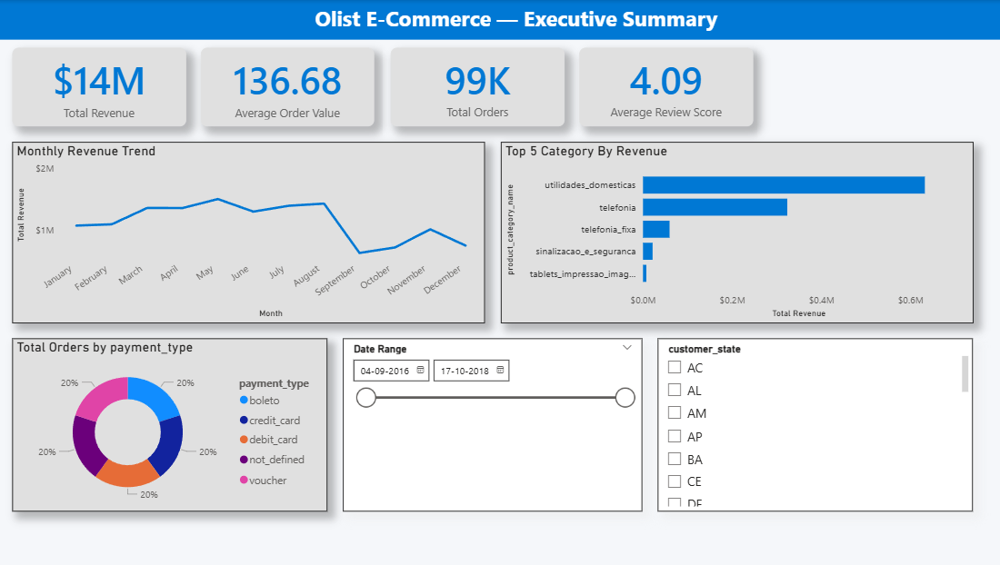
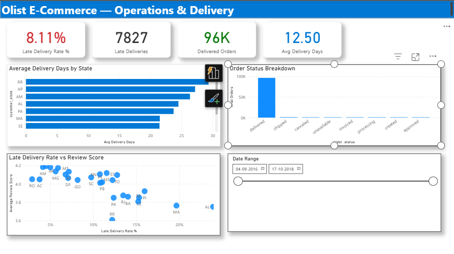
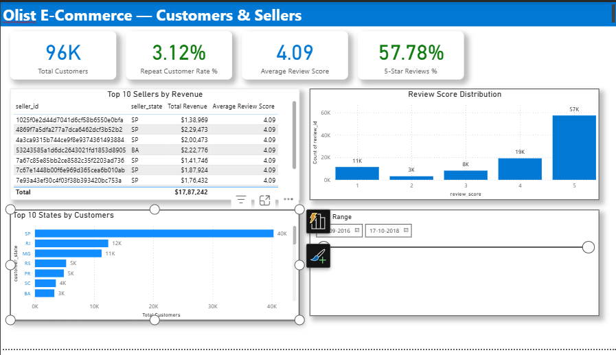

# Olist E-Commerce Analytics Dashboard

End-to-end Power BI dashboard analyzing 100,000+ orders from the Olist Brazilian E-Commerce dataset (2016–2018).

---

## Overview

This project demonstrates Power BI, DAX, and data modeling skills through a 3-page executive dashboard built on real e-commerce data.

**Dataset:** [Olist Brazilian E-Commerce](https://www.kaggle.com/datasets/olistbr/brazilian-ecommerce) — 9 tables, 100K+ orders

---

## Dashboard Pages

### Page 1 — Executive Summary
- 4 KPI Cards: Total Revenue ($14M), Average Order Value ($136.68), Total Orders (99K), Average Review Score (4.09)
- Monthly revenue trend
- Top 5 categories by revenue
- Payment method distribution
- Date + customer state slicers

### Page 2 — Operations & Delivery
- 4 KPI Cards: Late Delivery Rate (8.11%), Late Deliveries (7,827), Delivered Orders (96K), Avg Delivery Days (12.50)
- Average delivery days by state
- Order status breakdown
- Late delivery rate vs review score (scatter)

### Page 3 — Customers & Sellers
- 4 KPI Cards: Total Customers (96K), Repeat Customer Rate (3.12%), Average Review Score (4.09), 5-Star Reviews % (57.78%)
- Top 10 sellers by revenue
- Review score distribution (1-5 stars)
- Top 10 states by customers

---

## Key Business Insights

- **$13.5M total revenue** over 2016–2018, peak in November (Black Friday)
- **8.11% late delivery rate** — remote northern states (RR, AP, AM) average 20–26 days
- **3.12% repeat customer rate** — most customers buy once
- **57.78% of reviews are 5-star** — but 1-star reviews correlate with late deliveries
- **Top categories:** Health & Beauty, Watches & Gifts, Bed/Bath/Table

---

## Tech Stack

- Power BI Desktop — Star schema, DAX measures, dashboard design
- Power Query — Data transformation
- DAX — 15+ custom measures

---

## Files

| File | Description |
|------|-------------|
| `Olist_Dashboard.pbix` | Power BI dashboard file |
| `screenshots/` | Dashboard screenshots (3 pages) |

---

## How to Use

1. Install Power BI Desktop (free from Microsoft)
2. Download `Olist_Dashboard.pbix`
3. Open with Power BI Desktop
4. Interact with slicers to filter

---

## License

MIT — see [LICENSE](LICENSE)

---

## Author

**Junaid Narkar**
- LinkedIn: [linkedin.com/in/junaidnarkar-analyst](https://linkedin.com/in/junaidnarkar-analyst)
- GitHub: [github.com/junaid-Narkar](https://github.com/junaid-Narkar)
- Email: junaidnarkar01@gmail.com